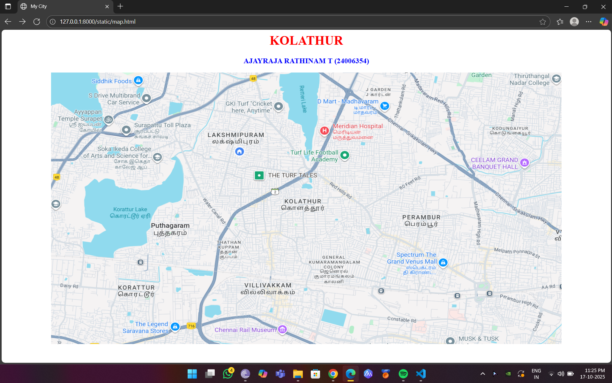
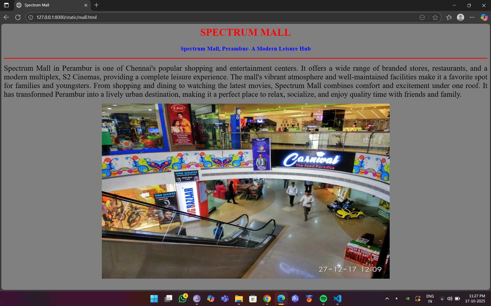
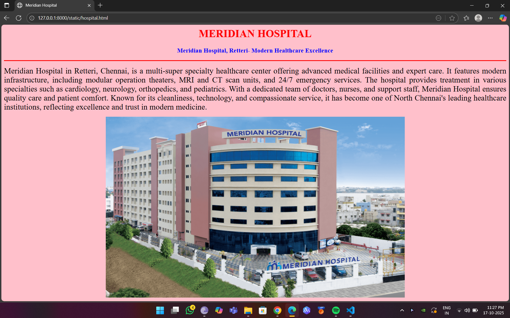
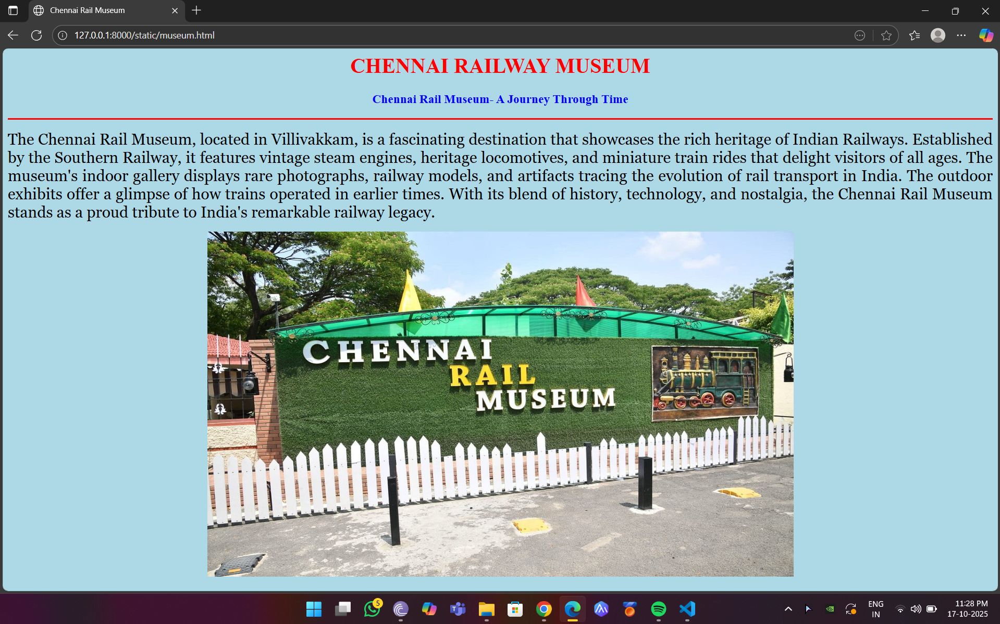
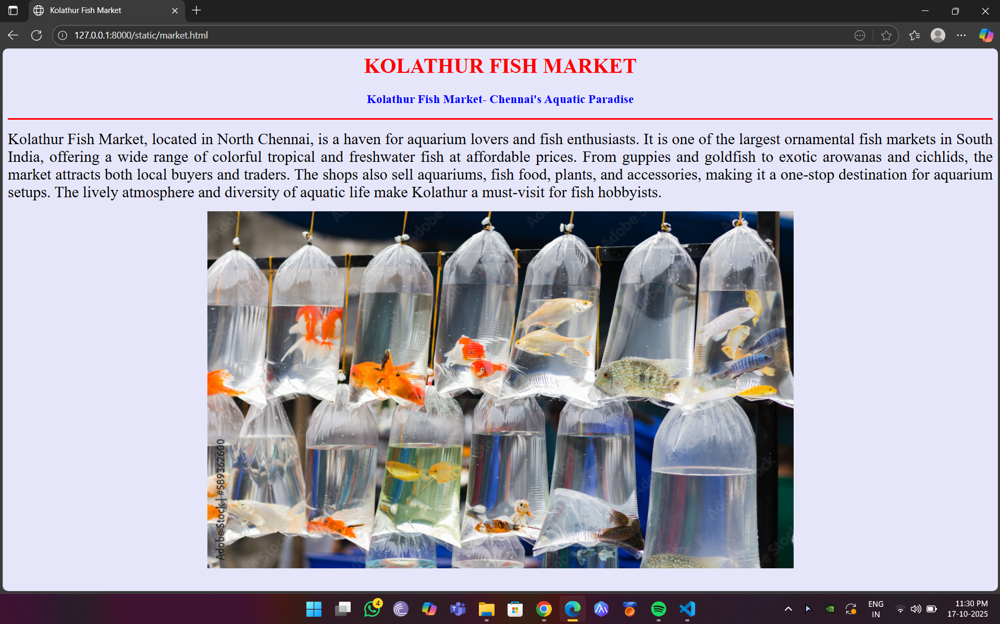
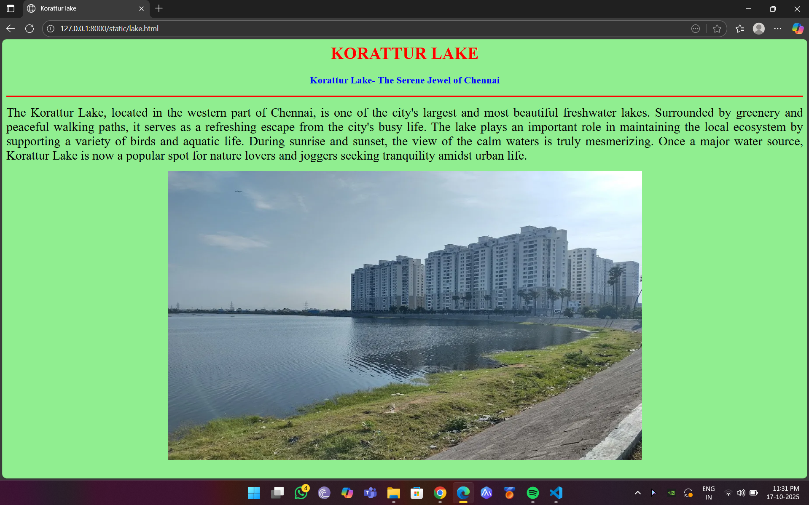

# Ex04 Places Around Me
## Date: 17/10/2025

## AIM
To develop a website to display details about the places around my house.

## DESIGN STEPS

### STEP 1
Create a Django admin interface.

### STEP 2
Download your city map from Google.

### STEP 3
Using ```<map>``` tag name the map.

### STEP 4
Create clickable regions in the image using ```<area>``` tag.

### STEP 5
Write HTML programs for all the regions identified.

### STEP 6
Execute the programs and publish them.

## CODE
```
map.html

<html>
<head>
<title>My City</title>
</head>
<body>
<h1 align="center">
<font color="red"><b>KOLATHUR</b></font>
</h1>
<h3 align="center">
<font color="blue"><b>AJAYRAJA RATHINAM T (24006354)</b></font>
</h3>
<center>

<map name="MyCity">
<area shape="rect" coords="900,500,990,450" href="mall.html" title="Spectrum Mall">
<area shape="rect" coords="655,112,770,153" href="hospital.html" title="Meridian Hospital">
<area shape="rect" coords="600,670,400,600" href="museum.html" title="Chennai Rail Museum ">
<area shape="rect" coords="700,300,550,360" href="market.html" title="Kolathur Fish Market">
<area shape="rect" coords="260,400,130,300" href="lake.html" title="Korattur Lake">
</map>
</center>
</body>
</html>

mall.html

<html>
<head>
<title>Spectrum Mall</title>
</head>
<body bgcolor="gray">
<h1 align="center">
<font color="red"><b>SPECTRUM MALL</b></font>
</h1>
<h3 align="center">
<font color="blue"><b>Spectrum Mall, Perambur- A Modern Leisure Hub</b></font>
</h3>
<hr size="3" color="red">
<p align="justify">
<font face="Chennai" size="5">
    Spectrum Mall in Perambur is one of Chennai's popular shopping and entertainment centers. It offers a wide range of branded stores, restaurants, and a modern multiplex, S2 Cinemas, providing a complete leisure experience. The mall's vibrant atmosphere and well-maintained facilities make it a favorite spot for families and youngsters. From shopping and dining to watching the latest movies, Spectrum Mall combines comfort and excitement under one roof. It has transformed Perambur into a lively urban destination, making it a perfect place to relax, socialize, and enjoy quality time with friends and family.
</p>
<center>
    
    </center>
</body>
</html>

hospital.html

<html>
<head>
<title>Meridian Hospital</title>
</head>
<body bgcolor="pink">
<h1 align="center">
<font color="red"><b>MERIDIAN HOSPITAL</b></font>
</h1>
<h3 align="center">
<font color="blue"><b>Meridian Hospital, Retteri- Modern Healthcare Excellence</b></font>
</h3>
<hr size="3" color="red">
<p align="justify">
<font face="Chennai" size="5">
Meridian Hospital in Retteri, Chennai, is a multi-super specialty healthcare center offering advanced medical facilities and expert care. It features modern infrastructure, including modular operation theaters, MRI and CT scan units, and 24/7 emergency services. The hospital provides treatment in various specialties such as cardiology, neurology, orthopedics, and pediatrics. With a dedicated team of doctors, nurses, and support staff, Meridian Hospital ensures quality care and patient comfort. Known for its cleanliness, technology, and compassionate service, it has become one of North Chennai's leading healthcare institutions, reflecting excellence and trust in modern medicine.


</p>
<center>
    
</center>

</body>
</html>

museum.html

<html>
<head>
<title>Chennai Rail Museum</title>
</head>
<body bgcolor="lightblue">
<h1 align="center">
<font color="red"><b>CHENNAI RAILWAY MUSEUM</b></font>
</h1>
<h3 align="center">
<font color="blue"><b>Chennai Rail Museum- A Journey Through Time</b></font>
</h3>
<hr size="3" color="red">
<p align="justify">
<font face="Georgia" size="5">
The Chennai Rail Museum, located in Villivakkam, is a fascinating destination that showcases the rich heritage of Indian Railways. Established by the Southern Railway, it features vintage steam engines, heritage locomotives, and miniature train rides that delight visitors of all ages. The museum's indoor gallery displays rare photographs, railway models, and artifacts tracing the evolution of rail transport in India. The outdoor exhibits offer a glimpse of how trains operated in earlier times. With its blend of history, technology, and nostalgia, the Chennai Rail Museum stands as a proud tribute to India's remarkable railway legacy.

</p>
<center>
    
</center>
</body>
</html>

market.html

<html>
<head>
<title>Kolathur Fish Market</title>
</head>
<body bgcolor="lavender">
<h1 align="center">
<font color="red"><b>KOLATHUR FISH MARKET</b></font>
</h1>
<h3 align="center">
<font color="blue"><b>Kolathur Fish Market- Chennai's Aquatic Paradise</b></font>
</h3>
<hr size="3" color="red">
<p align="justify">
<font face="Chennai" size="5">
    Kolathur Fish Market, located in North Chennai, is a haven for aquarium lovers and fish enthusiasts. It is one of the largest ornamental fish markets in South India, offering a wide range of colorful tropical and freshwater fish at affordable prices. From guppies and goldfish to exotic arowanas and cichlids, the market attracts both local buyers and traders. The shops also sell aquariums, fish food, plants, and accessories, making it a one-stop destination for aquarium setups. The lively atmosphere and diversity of aquatic life make Kolathur a must-visit for fish hobbyists.
</p>
<center>
    
    </center>
</body>
</html>

lake.html

<html>
<head>
<title>Korattur lake</title>
</head>
<body bgcolor="lightgreen">
<h1 align="center">
<font color="red"><b>KORATTUR LAKE</b></font>
</h1>
<h3 align="center">
<font color="blue"><b>Korattur Lake- The Serene Jewel of Chennai</b></font>
</h3>
<hr size="3" color="red">
<p align="justify">
<font face="Chennai" size="5">
    The Korattur Lake, located in the western part of Chennai, is one of the city's largest and most beautiful freshwater lakes. Surrounded by greenery and peaceful walking paths, it serves as a refreshing escape from the city's busy life. The lake plays an important role in maintaining the local ecosystem by supporting a variety of birds and aquatic life. During sunrise and sunset, the view of the calm waters is truly mesmerizing. Once a major water source, Korattur Lake is now a popular spot for nature lovers and joggers seeking tranquility amidst urban life.
</p>
<center>
    
    </center>
</body>
</html>


```


## OUTPUT









## RESULT
The program for implementing image maps using HTML is executed successfully.
